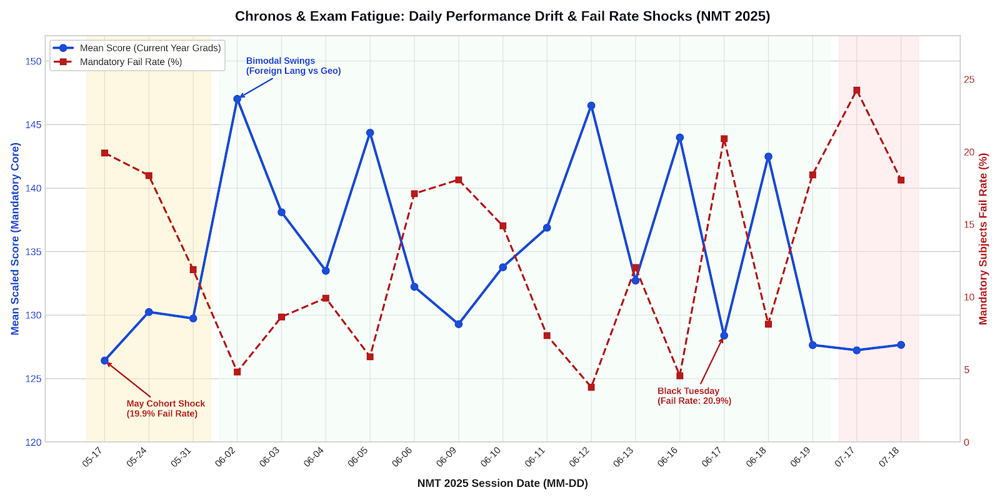
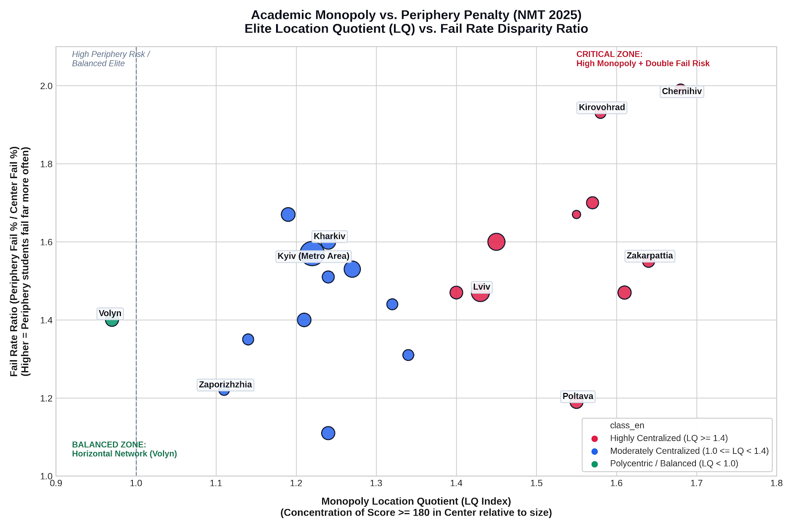
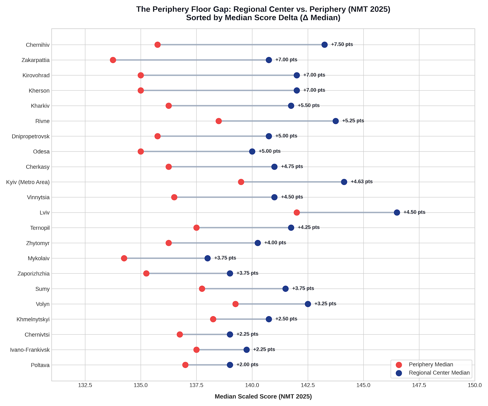
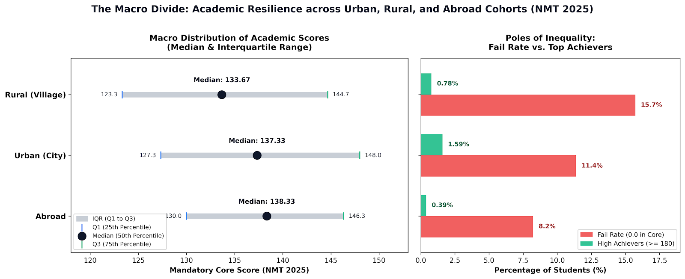
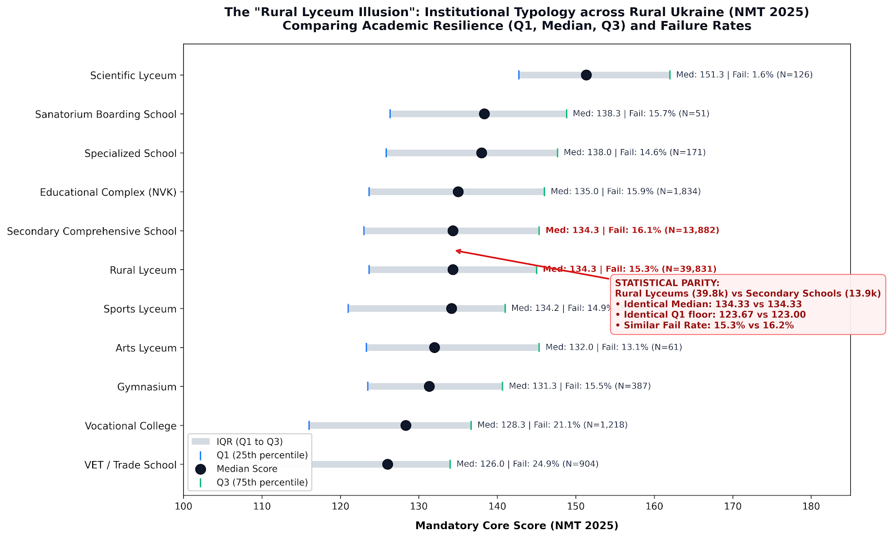
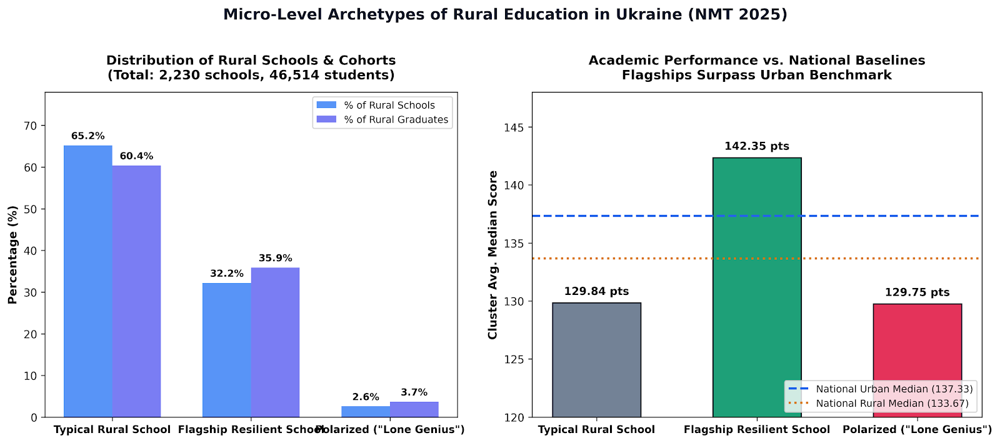
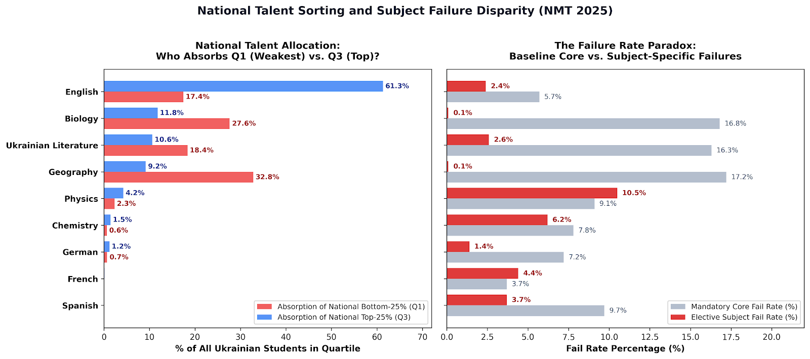
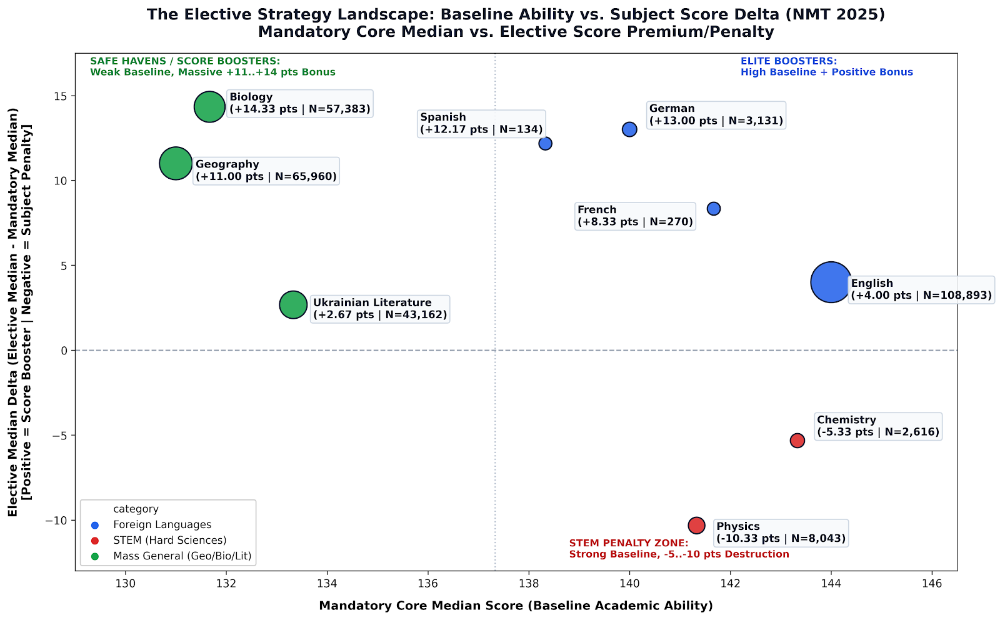
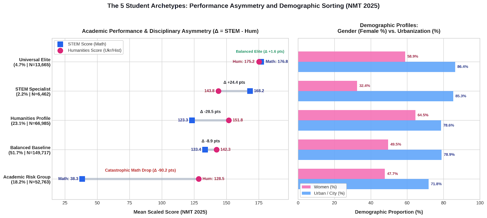
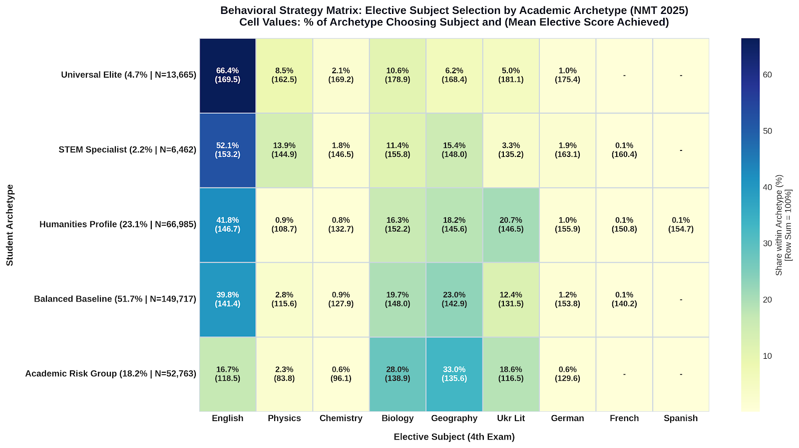

# NMT 2025 Analytics: Deep-Dive Examination & Educational Inequality Analysis in PostgreSQL


> The analysis of the results of the **National Multi-Subject Test (NMT) 2025** — the entrance exam to Ukrainian higher education institutions — was performed entirely using pure PostgreSQL.

## Executive Summary

Standardized testing is usually measured superficially—through regional or subject averages. This study sets a different goal: **finding hidden structural patterns** in how test date, geography, institution type, and choice of 4th subject shape outcome inequality—and separating real effects from statistical artifacts (sampling bias, uneven distribution of subjects across sessions, etc.).

- **Sample size:** 317,091 participants, 19 test sessions (May–July 2025).
- **Approach:** full cycle — from raw UCEQA data to normalized 3NF schema, analytical `VIEW`-storefronts and 5 independent research SQL scripts.
- **Stack:** PostgreSQL 15+, pure Analytical SQL, data modeling (Star Schema, Views/Marts).

---

## 1. Data Architecture

Instead of one wide "floating" table (where ~60% of the cells would be `NULL` due to different number of items for different participants), the data is organized in a **Star Schema**, normalized to **3NF**:

- **`participants`** / **`institutions`** / **`subjects`** — dimension tables (dimensions).
- **`exam_results`** — central fact table obtained `unpivot`-transformation (1 participant → up to 4 lines, one per subject).

A complete description of tables, relationships, and indexes is in [`docs/DATA_DICTIONARY.md`](docs/DATA_DICTIONARY.md). ERD diagram:


Two analytical layers (**Data Marts**) are built on top of the fact table so that research scripts do not duplicate the same logic `JOIN`/cleanup in each file:

| View | Granularity | Purpose |
|---|---|---|
| [`clean_exam_results`](sql/03_views/v_clean_exam_results.sql) | 1 line = 1 passed exam | Geolocation cleaning (City / Village / Abroad), attaching data about the institution. |
| [`student_academic_profiles`](sql/03_views/v_student_academic_profiles.sql) | 1 row = 1 participant | "Broad" student profile: expanded scores of the mandatory core, optional subject, average indicators. |

**Lineage (data flow):**

```
Raw source files
        │
        ▼
sql/01_setup/  →  staging table → ETL pipeline → indexes
        │ 
        ▼
   Star Schema (participants, institutions, subjects, exam_results)
        │
        ▼
sql/03_views/  →  v_clean_exam_results → v_student_academic_profiles
        │
        ▼
sql/02_analytics/  →  5 research modules (01–05)
```

---

## 2. Research Catalog: 5 analytical modules

Each module is designed according to a single standard: **Hypotheses → Result/Insight → `.sql` file and results**.

### Module 1 — Chronodynamics and the effect of fatigue (`01_chronos_and_exam_fatigue_dynamics`)

**Focus:** studying the impact of the calendar date of the session on testing results, testing the effect of psychological exhaustion (Exam Fatigue), and identifying hidden segregation of participants between sessions.

**Hypothesis 1 (The May Cohort Shock):**  
May Saturday sessions demonstrate a statistically higher proportion of failing to pass the threshold score (`scaled_score = 0.0`) and a lower median compared to regular June sessions, which is due to the dominance of graduates from previous years.  
* **Result: CONFIRMED.**  
  * **94.4% – 95.8%** of the participants of the three May Saturdays (40,767 people) consisted of graduates from previous years.
  * The average score of the mandatory block was only **123.5 – 128.8** points, and the failure rate reached **19.9%**.
  * The transition from the last May session (05/31) to the first day of June (06/02) caused a sharp jump in the average score by **+17.3 points** (from 129.7 to 147.0) and a drop in dropout from 11.9% to 4.8% due to the mass exit of this year's graduates (92.1% of the day's sample).

**Hypothesis 2 (Temporal Drift & Fatigue):**  
Among this year's graduates, there is a systematic decline in academic results from the beginning to the end of the regular June campaign.  
* **Result: CONFIRMED ON A WEEKLY LEVEL.**  
  * The weekly breakdown of the June session records a monotonic increase in the share of mandatory block blockages: **9.27%** (Week 1) → **11.22%** (Week 2) → **13.00%** (Week 3).
  * The average linear trend in performance drops by **-0.43 points per session**. However, the smooth trend in fatigue is offset by much stronger interday jumps.

**Hypothesis 3 (Day-over-Day Variance):**  
Day-over-Day deltas contain sharp anomalous spikes that exceed the natural variance of the sample, indicating differences in the actual difficulty of test suites on individual days.  
* **Result: CONFIRMED AND EXTENDED (KEY INSIGHT).**  
  * Enormous intraday volatility detected: standard deviation $\Delta_{\text{DoD}}$ amounted to **11.69 points** (with an amplitude of fluctuations from **-15.60** to **+17.29** points between adjacent days).
  * The source of the fluctuations is not the random complexity of the tasks, but the **bimodal segregation of testing days for the 4th sample subject** (correlation of the workload of the day and the average score: $r = -0.80$).



| June Session Cluster | Num. of Sessions | Avg. Participants Per Day | Avg. Graduate Score 2025 | Median | Avg. Fail Rate | Test Days |
|:---|:---:|:---:|:---:|:---:|:---:|:---|
| **Academic ("Foreign Languages")** | 5 | 15,557 | **144.87** | **145.13** | **5.44%** | 02.06, 05.06, 12.06, 16.06, 18.06 |
| **Major ("Geography / Lit")** | 9 | 18 421 | **132.50** | **135.00** | **14.14%** | 03.06, 04.06, 06.06, 09.06, 10.06, 11.06, 13.06, 17.06, 19.06 |

**Key anomalies:**
* **"Black Tuesday" June 17:** an anti-record of the June campaign — a daily collapse in the average score by **-15.60** (to 128.39) and a jump in the level of collapse to a peak **20.90%**.
* **July additional session (July 17–18):** the sample is reduced to ~2.5–2.8 thousand participants with parity of cohorts (~50% current year / ~50% previous years). The failure rate reached the maximum for the entire campaign — **24.25%** (July 17), and on July 18, the test was recorded in penal institutions (**1.3%** of the session).

**SQL module tools:**
* Multi-level CTEs for aggregation from the individual attendee level to the session calendar.
* Robust statistical constructs
* Window functions (`LAG()`, `ROW_NUMBER()`, window aggregations) and smoothing frames
* Dates handling & analysis

**Files:** [`sql/02_analytics/01_chronos_and_exam_fatigue_dynamics.sql`](sql/02_analytics/01_chronos_and_exam_fatigue_dynamics.sql) · [results (CSV)](results/01_chronos_and_exam_fatigue_dynamics.csv)

### Module 2 — Monopoly of regional centers and regional centralization (`02_capital_monopoly_and_regional_centralization`)

**Focus:** quantitative measurement of spatial educational inequality in the context of "Regional Center vs. Periphery", calculation of the localization index of the academic elite ($LQ$), assessment of the depth of decline in the basic level of knowledge in the regions and typology of education systems in 24 regions of Ukraine.
- **Coverage:** 22 representative regions with operating regional centers (Kyiv agglomeration consolidated as a single educational basin) + 2 front-line regions with special status (Donetsk, Luhansk).

**Hypothesis 1 (Elite Concentration / Law of Educational Oligopoly):**  
Concentration of academic elite (average score $\ge 180$ in all disciplines) in regional centers disproportionately exceeds their share in the total number of graduates in the region ($LQ > 1.0$).
* **Result: CONFIRMED FOR 95.5% OF REGIONS.**
  * In 21 out of 22 regions $LQ > 1.0$ (average national index — **1.36**).
  * **10 regions** entered the "Highly Centralized" cluster ($LQ \in [1.40; 1.68]$), where the main city concentrates a critical mass of excellent students.
  * Peak monopoly indicators were recorded in **Chernihiv ($LQ = 1.68$)**, **Transcarpathian ($LQ = 1.64$)** and **Rivne ($LQ = 1.61$)** regions.
  * At the same time, no region crossed the threshold of extreme hypermonopoly ($\ge 1.80$), since averaging grades across 4 disciplines naturally smooths out peak grades in individual subjects.



**Hypothesis 2 (The Periphery Floor Gap):**  
The periphery loses to the center not only in terms of the share of excellent students, but also demonstrates a critical decline in the basic level: a significantly lower median and an increased risk of failing the test (Fail Rate).
* **Result: 100% CONFIRMED (MAIN SYSTEM CONCLUSION).**
  * In **all 22 studied regions** the median score of the center exceeds the median of the periphery ($\Delta_{\text{Median}} > 0$). The average national gap is **+4.52 points**.
  * In **all 22 regions** the risk of failing the test in the periphery is significantly higher than in the regional center (`fail_rate_ratio` $> 1.0$, average — **1.51x**).



**Hypothesis 3 (Regional Typology & Outliers):**  
The regions of Ukraine, according to the spatial distribution of knowledge, fall into stable topological models with pronounced poles and anomalies.
* **Result: CONFIRMED.** 4 specific educational models were identified: Polycentric, Highly Centralized, Absolute Leader Model, and Frontier.


**Key insights and spatial anomalies**
* **The "Antimonopoly Phenomenon" of Volyn (The Only Balanced Region):**  
  Volyn region became the only region of Ukraine with an index $LQ < 1.0$ (**0.97**), where the periphery prepared a higher percentage of 180-pointers (**1.57%**) than the regional center Lutsk (**1.50%**). Thanks to a network of strong specialized lyceums in cities of regional significance (Kovel, Novovolynsk, Volodymyr), the region has formed a horizontal educational network without the leaching of talented students to the regional capital.
* **Pole of "double risk": Chernihiv and Kirovohrad regions:**  
  * **Chernihiv region** has an absolute anti-record median gap (**+7.50 points**) and failure ratio (**1.99x**): in the districts **16.14%** of graduates fail exams compared to **8.11%** in Chernihiv.
  * **Kirovohrad region** records a similar gap: $\Delta_{\text{Median}} = \mathbf{+7.00}$ points, and the risk of collapse in the periphery is **1.93 times** higher (18.29% vs 9.47%). In these areas, the periphery functions in a state of severe resource deprivation.
* **Lviv quality benchmark:**  
  Lviv region maintains its undisputed leadership in the country: the median of Lviv (**146.50**) and the median of districts (**142.00**) are the highest in Ukraine. Moreover, the periphery of Lviv region surpasses the regional centers of **18 other regions** (including Odessa, Kharkiv, Dnipro and Vinnytsia) in terms of the quality of knowledge, and the concentration of excellent students in districts (**2.11%**) is abnormally high for non-metropolitan territories.
* **Frontier distortions:**  
  * **Zaporizhzhya region:** **79.7%** of testing falls on Zaporizhzhia due to the proximity of the districts to the zone of active hostilities and temporary occupation.
  * **Donetsk and Luhansk regions:** 0% of participants in historical centers; 100% of the sample is represented by relocated institutions and free periphery with medians of **137.50** and **137.00**, respectively.

**SQL module tools:**
* Aggregation functions (`AVG()`, `COUNT()`, `BOOL_OR()`) with `FILTER`
* `CASE WHEN` classifications
* NULL handling with `NULLIF()`

**Files:** [`sql/02_analytics/02_capital_monopoly_and_regional_centralization.sql`](sql/02_analytics/02_capital_monopoly_and_regional_centralization.sql) · [results (CSV)](results/02_capital_monopoly_and_regional_centralization.csv)

### Module 3 — Rural Resilience and Institutional Polarization (`03_resilience_gap_and_rural_polarization`)

**Focus:** research into educational inequality along the "City - Village - Abroad" axis, empirical testing of the effectiveness of the rural lyceum reform (The Rural Lyceum Illusion), detection of intra-school polarization ("one genius effect"), and identification of hidden rural flagships of academic resilience.

**Hypothesis 1 (The Macro Divide):**  
Rural areas demonstrate a systemic decline in the lower threshold of knowledge and an increased dropout rate compared to urban institutions and foreign testing centers.  
* **Result: CONFIRMED.**  
  * The median of rural graduates (**133.67**) is **3.66 points** lower than the urban (**137.33**) and **4.66 points** lower than the foreign (**138.33**). The lower quartile in rural areas falls to **123.33** (versus 127.33 in the city).
  * The share of graduates who received $0.0$ points in at least one mandatory subject reaches **15.72%** in the village (versus **11.37%** in the city and **8.23%** abroad).
  * Share of academic elite ($\ge 180$ points) in the village is half as low as in the city: **0.78%** versus **1.59%**.
  * Foreign graduates (3,050 people) formed the phenomenon of a compressed distribution: the lowest interquartile range ($IQR = 16.33$), the lowest dropout rate (8.23%), but almost complete absence of excellent students (only **0.39%**).



**Hypothesis 2 (The Rural Lyceum Illusion):**  
The transformation of ordinary rural schools into "lyceums" did not provide a qualitative leap in the training of graduates and did not form a reliable protective threshold of knowledge.  
* **Result: 100% CONFIRMED (MAIN INSTITUTIONAL CONCLUSION).**  
  * Rural lyceums (39,831 students, 65.8% of the village sample) showed **full statistical parity** with regular secondary general education schools (13,882 students):
    * Absolutely identical median: **134.33** vs **134.33**;
    * Identical lower threshold ($Q_1$): **123.67** vs **123.00**;
    * Almost the same percentage of failure: **15.27%** vs **16.15%**.
  * The share of excellent students in regular rural schools turned out to be even higher than in lyceums: **1.02%** versus **0.77%**. The legal renaming of institutions did not affect academic results.
  * The critical risk zone is vocational education institutions (VET) and colleges in villages: the failure rate reaches **24.89%** and **21.10%**, respectively, with medians of $126.00$ and $128.33$.



**Hypothesis 3 (Rural Resilience Outliers vs. "One Genius"):**  
Despite the systemic backwardness of rural areas, a large-scale cluster of rural schools has been formed in Ukraine, which consistently outperform urban institutions in terms of the quality of education.  
* **Result: CONFIRMED AND EXTENDED.**  
  * **Flagship schools of sustainability:** **718 institutions (32.2%** of the rural network), where **16,694 graduates (35.9%)** studied, have an average median of **142.35 points**, which is **+5.02 points higher than the average urban benchmark of Ukraine (137.33)**.
  * **Polarized schools ("one genius effect"):** recorded only in **58 institutions (2.6%)**, where in the presence of single 180-scorers, the institution's median ($129.75$) falls below the average rural bottom.
  * **Typical rural schools:** cover **1,454 institutions (65.2%)** with 28,095 students and an average median of **129.84 points**.



**SQL module tools:**
* Cascade calculation of quantiles
* Calculating the interquartile range ($IQR$) and the coefficient of variation ($CV = \text{STDDEV} / \text{AVG}$) directly in aggregate queries.
* Window coating particles through a single-pass `COUNT(*) / SUM(COUNT(*)) OVER ()`.

**Files:** [`sql/02_analytics/03_resilience_gap_and_rural_polarization.sql`](sql/02_analytics/03_resilience_gap_and_rural_polarization.sql) · results: [`macro (CSV)`](results/03_resilience_gap_and_rural_polarization_macro.csv) · [`meso (CSV)`](results/03_resilience_gap_and_rural_polarization_meso.csv) · [`micro (CSV)`](results/03_resilience_gap_and_rural_polarization_micro.csv)

### Module 4 — Selection strategies and academic profile of the 4th subject (`04_elective_subject_strategy_and_student_cohorts`)

**Focus:** research into behavioral patterns of choosing an elective discipline, measuring the academic background of applicants through the prism of the mandatory core, assessing the absorption of weak students ("safe harbor effect"), and quantifying the scale deflationary penalty of exact disciplines (The STEM Penalty).

**Hypothesis 1 (The Elite Selection Filter / Segregation by Academic Preparation):**  
Disciplines of foreign philology and exact sciences concentrate applicants with a systematically higher level of basic knowledge than mass natural sciences and humanities subjects.  
* **Result: CONFIRMED.**  
  * A clear gap in the basic median was identified: English (**144.00**), Chemistry (**143.33**), French (**141.67**), Physics (**141.33**) and German (**140.00**) form an elite cluster. On the other hand, Ukrainian Literature (**133.33**), Biology (**131.67**) and Geography (**131.00**) have significantly weaker basic training.
  * **Monopoly of English (108,893 students, 37.6% of choice):** absorbed **61.33% of all graduates from the top quartile of Ukraine ($Q_3$)**. The failure rate in the basic block among English-speaking participants is only **5.7%**.

**Hypothesis 2 (The "Safe Haven" Effect / The Phenomenon of Geography and Absorption of Weak Cohorts):**  
Geography functions as a no-alternative “safe harbor” for at-risk applicants, providing a minimal barrier to entry by truncating the upper tail of the distribution.  
* **Result: 100% CONFIRMED.**  
  * Geography (65,960 students, 22.78%) has the lowest baseline median in the country (**131.00**), the highest dropout rate in the mandatory core (**17.2%**), and the lowest share of excellent students (**0.3%**).
  * Geography absorbed **32.82% of all students in the bottom quartile of Ukraine ($Q_1$)**. Together with Biology (27.63%) and Ukrainian Literature (18.38%), they accumulate **78.83% of the weakest graduates in the country**.
  * It is practically impossible to fail Geography: the share of zero grades is a record **0.1%**, and the median artificially increases by **+11.00 points** (to 142.00). However, the price is the lack of high grades: only **0.2%** of participants were able to overcome the threshold of 180 points.



**Hypothesis 3 (Score Premium vs. STEM Penalty):**  
The scaling of the NMT creates a severe deflation of scores for graduates who choose exact sciences, punishing motivated applicants for choosing a STEM major.  
* **Result: CONFIRMED (MAIN SYSTEM CONCLUSION).**  
  * **Physics (8,043 students) and Chemistry (2,616 students) are the only subjects with a negative delta:**  
    * Physics test takers have the highest proportion of excellent students in the core (**5.2% have $\ge 180$**), but receive a median penalty of **-10.33 points** (median drops from 141.33 to 131.00), the average score collapses by **-20.66 points** (from 140.88 to 120.22), and the crash rate soars to the highest in the campaign — **10.5%**.
    * Chemistry shows a median drop of **-5.33 points** and a dropout rate of **6.2%**.
  * **Asymmetrical ranking boosters:**  
    * **Biology:** provides a whopping bonus of **+14.33 points** to the median (from 131.67 to 146.00) with a dropout rate of **0.1%**;
    * **German and Spanish:** add **+13.00** and **+12.17** points respectively, providing 7.6% and 13.4% of excellent students.



**SQL module tools:**
* Calculating the national quartiles of the base core through a single isolated CTE with `PERCENTILE_CONT(0.25 | 0.75)` and `CROSS JOIN`.
* Advanced percentage calculations and aggregations

**Files:** [`sql/02_analytics/04_elective_subject_strategy_and_student_cohorts.sql`](sql/02_analytics/04_elective_subject_strategy_and_student_cohorts.sql) · [results (CSV)](results/04_elective_subject_strategy_and_student_cohorts.csv)

### Module 5 — Student Disciplinary Asymmetry: STEM vs. Humanities (`05_asymmetrical_student_stem_vs_humanities`)

**Focus:** exploring the intrapersonal gap between the sciences and the humanities at the level of the individual student ($\Delta_{\text{Asymmetry}} = \text{score\_math} - \frac{\text{score\_ukr} + \text{score\_hist}}{2}$), psychometric typing of graduates into 5 intellectual archetypes, identification of gender-spatial segregation, and cross-analysis of the choice of the 4th subject.
- **Evaluated vectors:** STEM vector (Mathematics) vs. Humanities core (Ukrainian language + History of Ukraine).

**Hypothesis 1 (The Asymmetry Imbalance):**  
The distribution of asymmetry among Ukrainian graduates is sharply shifted towards humanitarian thinking; the share of pronounced humanitarians is many times higher than the share of pure STEM specialists.  
* **Result: CONFIRMED (RATIO 10.4 : 1).**  
  * **Humanities profile:** accounts for **23.1% of the sample (66,985 students)** with an average gap $\Delta = \mathbf{-28.5}$ child ($\text{Math} = 123.3$ vs $\text{Hum} = 151.8$).
  * **STEM majors:** make up only **2.2% of the sample (6,462 students)** with a median gap $\Delta = \mathbf{+24.4}$ child ($\text{Math} = 168.2$ vs $\text{Hum} = 143.8$).
  * For every pronounced “techie” in Ukraine, there are over 10 pronounced “humanities.” Even in the “Balanced Base” group (51.7% of the sample), the average delta is **-8.9 points** in favor of language and history.
  * **Gender Polarity:** STEM majors are **67.6% male** (2:1 skew), while Humanities majors are **64.5% female**. The Balanced group is completely equal (49.5% female / 50.5% male).

**Hypothesis 2 (The Universalist Scarcity):**  
Academic universals ($\ge 160$ points in both directions) is a rare elite, monopolized by urban educational institutions.  
* **Result: CONFIRMED AND EXTENDED.**  
  * Only **4.7% (13,665 students)** achieved "Academic All-Rounder" status with a near-perfect balance of top scores: Mathematics — **176.8**, Humanities — **175.2** ($\Delta = +1.6$).
  * **Urban monopoly:** **86.4% of Universals** live in cities, and only **13.0%** live in villages (a deficit of rural representation of 1.6 times compared to the base population structure).
  * **Women's paradox:** despite the dominance of boys in the pure STEM cluster, among the highest level of intellectual capital (Universals) **58.9% are women**.

**Hypothesis 3 (The Asymmetric Safety Floor):**  
The basic level of training between disciplines is asymmetrical: the humanities core has a stable bottom, while mathematics demonstrates a catastrophic risk of collapse.  
* **Result: 100% CONFIRMED (SYSTEMIC PHENOMENON).**  
  * **Academic risk group (52,763 students, 18.2%):** the average score in mathematics collapses to a catastrophic **38.3 points** (massive zero grades beyond the threshold), while humanities subjects maintain an acceptable level **128.5 points**. The internal gap is a record **-90.2 points**.
  * For STEM majors, there is no such thing as a humanities failure: their average score in language and history is **143.8 points** (above the national average). Mathematics is the only hard selective barrier in the campaign.



**In addition(Strategic Elective Selection: Game Theory over Vocation):**
The 4th elective exam functions not as a vocational preference indicator, but as a game-theoretic utility optimization problem. Candidates strategically balance university admission score inflation against the catastrophic penalty of failing the cutoff threshold.

* **Universal Elite (4.7% | N=13,665):** Strongly select for high-yield competitive admissions. **66.4% choose English** (mean: 169.5), followed by **Biology at 10.6%** (mean: 178.9, catering to top-tier medical tracks). Only **8.5% opt for Physics**, despite achieving elite scores (mean: 162.5).
* **STEM Specialists (2.2% | N=6,462): The Self-Cannibalization Paradox.** Over **84% of students with clear algorithmic dominance abandon STEM electives**. Only **13.9% select Physics** and **1.8% select Chemistry**. Instead, **52.1% migrate to English** (mean: 153.2) and **15.4% hedge with Geography** (mean: 148.0) to evade the strict scoring deflation of technical subjects.
* **Humanities Profile (23.1% | N=66,985):** Exhibit a classic liberal arts profile, splitting selections between **English (41.8%)** and **Ukrainian Literature (20.7%)**, with a secondary safety hedge into **Geography (18.2%)** and **Biology (16.3%)**. Physics adoption is virtually absent (**0.9%**).
* **Balanced Baseline (51.7% | N=149,717):** Mirror the overall macro distribution with a pragmatic tilt: **39.8% English**, **23.0% Geography**, and **19.7% Biology**, demonstrating broad reliance on general subjects with moderate grade guarantees.
* **Academic Risk Group (18.2% | N=52,763): The Flight to Safety.** Strongly avoid high-barrier subjects, concentrating **61.0% of their total volume into Geography (33.0%) and Biology (28.0%)**. These subjects offer near-zero failing rates (0.1% nationwide cutoff failure) and supply an artificial grade cushion (+11 to +14 points above baseline ability). The **2.3% who mistakenly selected Physics collapsed to a mean of 83.8 points**.



**SQL module tools:**
* Parallel aggregation of gender (`women_pct`, `men_pct`) and spatial (`rural_pct`, `city_pct`) particles through conditional `FILTER`.
* Two-level window division `DENSE_RANK() OVER (PARTITION BY archetype ORDER BY COUNT(*) DESC)` for matrix analysis of behavioral choices.

**Files:** [`sql/02_analytics/05_asymmetrical_student_stem_vs_humanities.sql`](sql/02_analytics/05_asymmetrical_student_stem_vs_humanities.sql) · results: [`archetypes (CSV)`](results/05_asymmetrical_student_stem_vs_humanities_1.csv) · [`electives by archetype (CSV)`](results/05_asymmetrical_student_stem_vs_humanities_2.csv)

---

## 3. Repository structure

```text
├── sql/
│   ├── 01_setup/       # DDL, staging-table, ETL-pipeline, indexes
│   ├── 02_analytics/   # 5 research SQL-scripts
│   └── 03_views/       # Analytic views (clean_exam_results, student_academic_profiles)
├── docs/                # Data dictionary, ERD
├── results/             # Queries results (CSV)
└── README.md
```

---

## 4. Conclusions and practical value (Key Takeaways)

A large-scale study of the 2025 NMT results array using analytical SQL tools allowed us to go beyond the traditional superficial analysis of "average scores" and empirically prove that educational inequality in Ukraine is systemically constructed. 

Below are the 5 main structural conclusions of the project and their applied significance for the state's educational policy.

---

### I. Debunking System Myths of Standardized Testing

1. **The Myth of “Task Origins” and Unstable Session Difficulty (Module 1):**
   * *Imagination:* The sharp fluctuations in performance between June days (the range of inter-day jumps from **-15.60** to **+17.29** points) were attributed in society to "test showers" or random inequality of options.
   * *Empirical reality:* Fluctuations are of an artificial nature due to the segregation of the contingent. The June calendar campaign split into two parallel clusters: 5 “elite” days of foreign language testing (average score **144.87**, dropout rate **5.4%**) and 9 “mass” days of geography and literature (average score **132.50**, dropout rate **14.1%**). The correlation between the workload of the day and the average score reaches **$r = -0.80$**.

2. **The Rural Lyceum Illusion (Module 3):**
   * *Imagination:* The massive reorganization of rural secondary schools into "lyceums" as part of educational reform raises the academic level of the institutions.
   * *Empirical reality:* **absolute statistical parity** has been found between newly established rural lyceums (39.8 thousand students) and classical secondary schools (13.9 thousand students). Their medians are identical (**134.33** vs **134.33**), the lower quartile $Q_1$ does not differ (**123.67** vs **123.00**), and the share of excellent students in regular secondary schools is even higher (**1.02%** vs **0.77%**). The legal change in the sign did not create added value without changing the educational environment.

3. **Resilience of rural education against the myth of "continuous depression" (Module 3):**
   * Despite the general lag of the village from the city (the median is 3.66 points lower, the risk of collapse is 1.4 times higher), a third of the rural network — **718 schools (32.2%)**, which graduated **16.7 thousand students**, — are **full-fledged flagships of sustainability**. Their average median (**142.35**) exceeds the national urban level by **+5.02 points (137.33)**. At the same time, the myth of the "school of one genius" (where there is a 180-pointer against the background of the institution's failure) was confirmed for only 2.6% of rural institutions.

---

### II. Spatial segregation: the failure of the educational bottom of the periphery

The study of the interaction "Regional Center vs. Periphery" (Module 2) showed that the main spatial problem of Ukraine is not the concentration of excellent students, but the **critical insecurity of the basic level of knowledge in the districts**:

* **Failure of the educational bottom:** In all 22 representative regions, the median of the center is higher than the median of the districts (national gap — **+4.52 points**, with peaks of **+7.50** in Chernihiv region and **+7.00** in Kirovohrad region and Zakarpattia).
* **Double risk of failure:** The risk of failing a mandatory exam in the periphery is systematically higher by **1.51 times**, and in Chernihiv and Kirovohrad regions this figure reaches **1.99x** and **1.93x**, respectively. The correlation between the median gap and the failure rate is **$r = 0.81$**.
* **Polycentric precedent of Volyn:** Volyn region became the only region of Ukraine with a balanced structure ($LQ = 0.97$), where the share of 180-score students in the districts (**1.57%**) turned out to be higher than in the regional center (**1.50%**). Strong lyceums in Kovel, Novovolynsk, and Volodymyr formed a horizontal decentralized network, proving the possibility of overcoming the monopoly of the metropolis.

---

### III. Game Theory in Subject Choice: The Destructive STEM Penalty Trap

The most critical conclusion of the project (Modules 4 and 5) for the economy and defense capability is the identification of **systemic discrimination against engineering and technical disciplines**:

1. **The STEM Penalty on the NMT Scale:**
   * Selective disciplines operate under diametrically opposed rules of the game:
     * **Physics and Chemistry act as a deflationary penalty:** physics applicants have the highest basic preparation in the country (5.2% of excellent students in the core), but the physics exam itself collapses their median by **-10.33 points**, the average score by **-20.66 points**, and the dropout rate jumps to a record **10.5%**.
     * **Geography and Biology act as inflationary boosters:** they artificially add **+11.00** and **+14.33 points** to the median applicant's score with almost zero risk of dropout (**0.1%**).
2. **Rational self-cannibalization of STEM capital:**
   * Students react to the rules of the game as rational economic agents: **over 84% of natural "techies" (STEM specialists) refuse physics and chemistry**. Only 13.9% of them choose physics, while **52.1% migrate to English**, and **15.4% choose geography** to artificially protect a competitive score.
3. **Geography as a country's main "safe harbor":**
   * Geography accumulated **32.8% of the weakest students in Ukraine ($Q_1$)** and a third of the Academic Risk Group, providing a 99.9% guarantee of overcoming the threshold score at the cost of a complete absence of excellent students (only 0.2% exceeded 180 points).

---

### IV. Psychometric Structure: The Shortage of Universals and the Fragility of Mathematics

Segmentation of graduates by intrapersonal asymmetry (Module 5) showed the real balance of intellectual capital:

* **Humanities dominance (10.4 : 1):** For every expressed STEM specialist (2.2% of the population, average delta $\Delta = +24.4$) there are more than ten pronounced humanitarians (23.1% of the population, average delta $\Delta = -28.5$).
* **Academic all-rounders as a scarce elite:** Only **4.7% of graduates (13.7 thousand people)** are able to show elite results ($\ge 160$) simultaneously in the exact sciences and humanities. This capital is **86.4% urbanized** (universals are almost twice as rare in the countryside). Moreover, among the Universals, **female dominance (58.9%)** is recorded, despite the fact that in the narrow STEM sector, men prevail (67.6%).
* **Asymmetry of the protective barrier:** The academic risk group (18.2% of graduates) collapses solely because of **mathematics (average score 38.3 versus 128.5 in the humanities block)**. Basic verbal literacy is guaranteed by high school to all students, while the mathematical bottom is completely permeable.

---

### V. Practical recommendations for educational stakeholders

#### 1. For the Ministry of Education and Science (MES) and UCEQA:
* **Reform of scaling and leveling of difficulty (Test Equating):** It is necessary to move away from primitive tables of conversion of raw scores to psychometric equalization according to the IRT (Item Response Theory) model. Passing physics or chemistry should not automatically take away 10–15 points of the competitive rating from an applicant compared to geography or biology.
* **Increase in weightings for STEM:** In the Admission Requirements for Technical, Engineering and IT majors, the weighting for Physics/Chemistry should be significantly higher to compensate applicants for academic risk.
* **Audit of high school reform and support for rural flagships:** Stop the formal change of status of institutions. State investments and subventions should be targeted at supporting the identified **718 rural flagship schools** as natural centers of attraction of educational districts.
* **Emergency intervention in basic mathematics education:** Since mathematics accounts for 90% of dropouts in the at-risk group, diagnostic testing after grade 9 and targeted catch-up programs in rural communities are needed.

#### 2. For applicants and educators:
* **Pragmatic assessment of subject strategies:** The choice of elective discipline should take into account the target specialty: if the formula for calculating the competitive score in a particular higher education institution does not give physics a significant coefficient priority, taking English or geography remains a mathematically more advantageous strategy for minimizing risks.
* **Development of universal skills:** The market advantage of future specialists is concentrated in the area of ​​​​a harmonious combination of algorithmic thinking and verbal communication - a cluster where less than 5% of the country's graduates are currently located.

## 5. Developed SQL concepts and technical stack

* **Data design and normalization:** modeling the Star Schema (3NF), deploying sparse member data into a long fact table (Unpivot), and imposing integrity constraints.
* **Analytical data marts:** isolating cleansing and pre-aggregation business logic in marts (`VIEW`) at the levels of the individual exam and the student profile.
* **Robust descriptive statistics:** calculation of nonparametric quantiles, median, and interquartile range (IQR) using `PERCENTILE_CONT(...) WITHIN GROUP (ORDER BY ...)`.
* **One-pass conditional aggregation:** syntax usage `FILTER (WHERE ...)` for simultaneous calculation of polar group metrics (center/periphery, gender) in a single pass without using slow `SELF-JOIN`.
* **Analytical window functions:** inline navigation by testing days (`LAG`), smoothing trends with a moving average (`ROWS BETWEEN`), cumulative sums, ranking (`DENSE_RANK`) and calculating market coverage shares through an unfixed window `OVER ()`.
* **Modular query pipelines:** decomposition of complex analytical tasks through multi-level CTEs and adherence to the DRY principle thanks to named windows (`WINDOW w AS (...)`).
* **Cascading business logic and validation:** multi-factor school categorization and student typology using `CASE WHEN`, as well as Boolean detection of exam failure due to `BOOL_OR()`.
* **Working with dates and time series:** extracting calendar attributes via `EXTRACT()`, parsing of testing phases and grouping by days of the week.
* **Table Joins and Benchmarking:** combining facts with dimensions and safely pulling global medians to each row through `CROSS JOIN` with single-line CTEs.
* **Data cleaning and calculation protection:** handling missing values `NULL`, safe sharing without risk `division by zero` through `NULLIF()`.
* **Optimization of queries and calculations:** algebraic simplification of the concentration index (LQ) calculation into a single fraction to eliminate errors `FLOAT`, moving resource-intensive percentile sorting into intermediate steps, and analyzing execution plans.

## 6. Technical Details
- **Database:** PostgreSQL
- **Analysis Tools:** PostgreSQL, Dbeaver, VS Code
- **Visualization:** Gemini