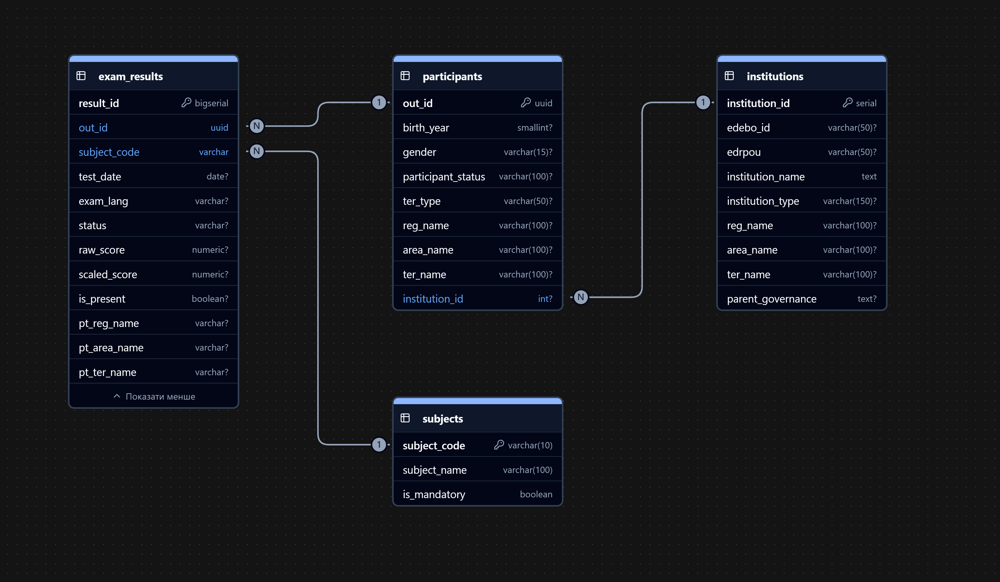

# NMT 2025 Analytics: Deep-Dive Examination & Educational Inequality Analysis in PostgreSQL


> The analysis of the results of the **National Multi-Subject Test (NMT) 2025** — the entrance exam to Ukrainian higher education institutions — was performed entirely using pure PostgreSQL.

## Executive Summary

Standardized testing is usually measured superficially—through regional or subject averages. This study sets a different goal: **finding hidden structural patterns** in how test date, geography, institution type, and choice of 4th subject shape outcome inequality—and separating real effects from statistical artifacts (sampling bias, uneven distribution of subjects across sessions, etc.).

- **Sample size:** 317,091 participants, 19 test sessions (May–July 2025).
- **Approach:** full cycle — from raw UCEQA data to normalized 3NF schema, analytical `VIEW`-storefronts and 5 independent research SQL scripts.
- **Stack:** PostgreSQL 15+, pure Analytical SQL, data modeling (Star Schema, Views/Marts).

---

## 1. Data Architecture

Instead of one wide "floating" table (where ~60% of the cells would be `NULL` due to different number of items for different participants), the data is organized in a **Star Schema**, normalized to **3NF**:

- **`participants`** / **`institutions`** / **`subjects`** — dimension tables (dimensions).
- **`exam_results`** — central fact table obtained `unpivot`-transformation (1 participant → up to 4 lines, one per subject).

A complete description of tables, relationships, and indexes is in [`docs/DATA_DICTIONARY.md`](docs/DATA_DICTIONARY.md). ERD diagram:



Two analytical layers (**Data Marts**) are built on top of the fact table so that research scripts do not duplicate the same logic `JOIN`/cleanup in each file:

| View | Granularity | Purpose |
|---|---|---|
| [`clean_exam_results`](sql/03_views/v_clean_exam_results.sql) | 1 line = 1 passed exam | Geolocation cleaning (City / Village / Abroad), attaching data about the institution. |
| [`student_academic_profiles`](sql/03_views/v_student_academic_profiles.sql) | 1 row = 1 participant | "Broad" student profile: expanded scores of the mandatory core, optional subject, average indicators. |

**Lineage (data flow):**

```
Raw source files
        │
        ▼
sql/01_setup/  →  staging table → ETL pipeline → indexes
        │ 
        ▼
   Star Schema (participants, institutions, subjects, exam_results)
        │
        ▼
sql/03_views/  →  v_clean_exam_results → v_student_academic_profiles
        │
        ▼
sql/02_analytics/  →  5 research modules (01–05)
```

---

## 2. Research Catalog: 5 analytical modules

Each module is designed according to a single standard: **Hypotheses → Result/Insight → `.sql` file and results**.

### Module 1 — Chronodynamics and the effect of fatigue (`01_chronos_and_exam_fatigue_dynamics`)

**Focus:** studying the impact of the calendar date of the session on testing results, testing the effect of psychological exhaustion (Exam Fatigue), and identifying hidden segregation of participants between sessions.

**Hypothesis 1 (The May Cohort Shock):**  
May Saturday sessions demonstrate a statistically higher proportion of failing to pass the threshold score (`scaled_score = 0.0`) and a lower median compared to regular June sessions, which is due to the dominance of graduates from previous years.  
* **Result: CONFIRMED.**  
  * **94.4% – 95.8%** of the participants of the three May Saturdays (40,767 people) consisted of graduates from previous years.
  * The average score of the mandatory block was only **123.5 – 128.8** points, and the failure rate reached **19.9%**.
  * The transition from the last May session (05/31) to the first day of June (06/02) caused a sharp jump in the average score by **+17.3 points** (from 129.7 to 147.0) and a drop in dropout from 11.9% to 4.8% due to the mass exit of this year's graduates (92.1% of the day's sample).

**Hypothesis 2 (Temporal Drift & Fatigue):**  
Among this year's graduates, there is a systematic decline in academic results from the beginning to the end of the regular June campaign.  
* **Result: CONFIRMED ON A WEEKLY LEVEL.**  
  * The weekly breakdown of the June session records a monotonic increase in the share of mandatory block blockages: **9.27%** (Week 1) → **11.22%** (Week 2) → **13.00%** (Week 3).
  * The average linear trend in performance drops by **-0.43 points per session**. However, the smooth trend in fatigue is offset by much stronger interday jumps.

**Hypothesis 3 (Day-over-Day Variance):**  
Day-over-Day deltas contain sharp anomalous spikes that exceed the natural variance of the sample, indicating differences in the actual difficulty of test suites on individual days.  
* **Result: CONFIRMED AND EXTENDED (KEY INSIGHT).**  
  * Enormous intraday volatility detected: standard deviation $\Delta_{\text{DoD}}$ amounted to **11.69 points** (with an amplitude of fluctuations from **-15.60** to **+17.29** points between adjacent days).
  * The source of the fluctuations is not the random complexity of the tasks, but the **bimodal segregation of testing days for the 4th sample subject** (correlation of the workload of the day and the average score: $r = -0.80$).

| June Session Cluster | Num. of Sessions | Avg. Participants Per Day | Avg. Graduate Score 2025 | Median | Avg. Fail Rate | Test Days |
|:---|:---:|:---:|:---:|:---:|:---:|:---|
| **Academic ("Foreign Languages")** | 5 | 15,557 | **144.87** | **145.13** | **5.44%** | 02.06, 05.06, 12.06, 16.06, 18.06 |
| **Major ("Geography / Lit")** | 9 | 18 421 | **132.50** | **135.00** | **14.14%** | 03.06, 04.06, 06.06, 09.06, 10.06, 11.06, 13.06, 17.06, 19.06 |

**Key anomalies:**
* **"Black Tuesday" June 17:** an anti-record of the June campaign — a daily collapse in the average score by **-15.60** (to 128.39) and a jump in the level of collapse to a peak **20.90%**.
* **July additional session (July 17–18):** the sample is reduced to ~2.5–2.8 thousand participants with parity of cohorts (~50% current year / ~50% previous years). The failure rate reached the maximum for the entire campaign — **24.25%** (July 17), and on July 18, the test was recorded in penal institutions (**1.3%** of the session).

**SQL module tools:**
* Multi-level CTEs for aggregation from the individual attendee level to the session calendar.
* Robust statistical constructs `PERCENTILE_CONT(0.5) WITHIN GROUP (...) FILTER (...)`.
* Navigation window offsets `LAG(...) OVER w` for calculating intersession steps.
* Smoothing frames `ROWS BETWEEN 1 PRECEDING AND 1 FOLLOWING`.
* Cumulative coverage of campaign progress through window aggregates.

**Files:** [`sql/02_analytics/01_chronos_and_exam_fatigue_dynamics.sql`](sql/02_analytics/01_chronos_and_exam_fatigue_dynamics.sql) · [results (CSV)](results/01_chronos_and_exam_fatigue_dynamics.csv)

### Module 2 — Monopoly of regional centers (`02_capital_monopoly_and_regional_centralization`)

**Focus:** TBD

*Hypotheses, tools, results — TBD.*

### Module 3 — Resilience Gap and Rural Polarization (`03_resilience_gap_and_rural_polarization`)

**Focus:** TBD

*Hypotheses, tools, results — TBD.*

### Module 4 — Strategy for choosing the 4th subject (`04_elective_subject_strategy_and_student_cohorts`)

**Focus:** TBD

*Hypotheses, tools, results — TBD.*

### Module 5 — STEM vs Humanities Asymmetry (`05_asymmetrical_student_stem_vs_humanities`)

**Focus:** TBD
*Hypotheses, tools, results — TBD.*

---

## 3. Repository structure

```text
├── sql/
│   ├── 01_setup/       # DDL, staging-table, ETL-pipeline, indexes
│   ├── 02_analytics/   # 5 research SQL-scripts
│   └── 03_views/       # Analytic views (clean_exam_results, student_academic_profiles)
├── docs/                # Data dictionary, ERD
├── results/             # Queries results (CSV)
└── README.md
```

---

## 4. Conclusions and practical value (Key Takeaways)

*The section will be supplemented after the completion of all 5 modules — a summary of the main conclusions and their practical value for regulators (MES, UCEQA) and applicants.*
